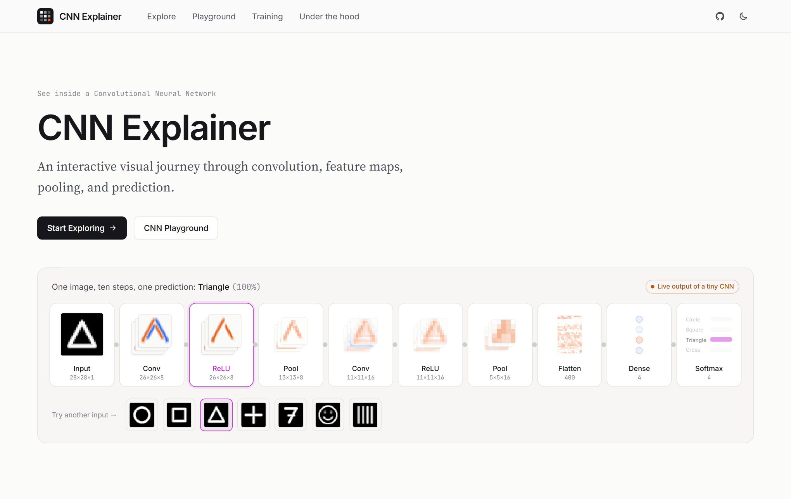
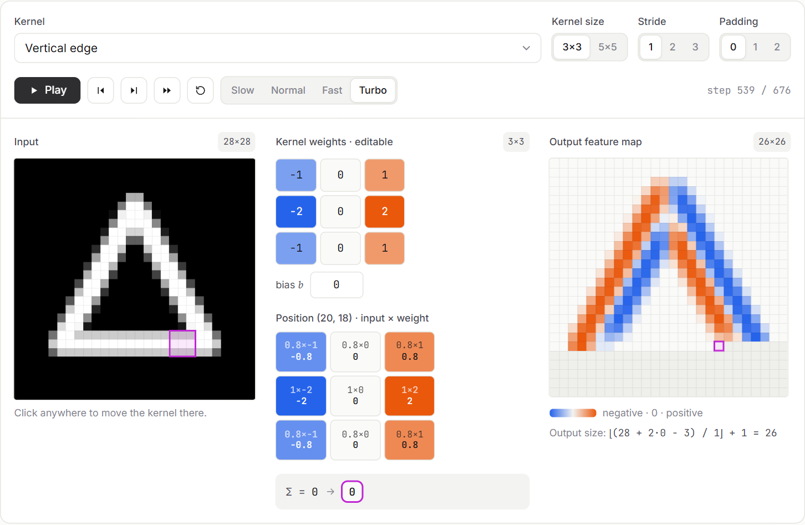
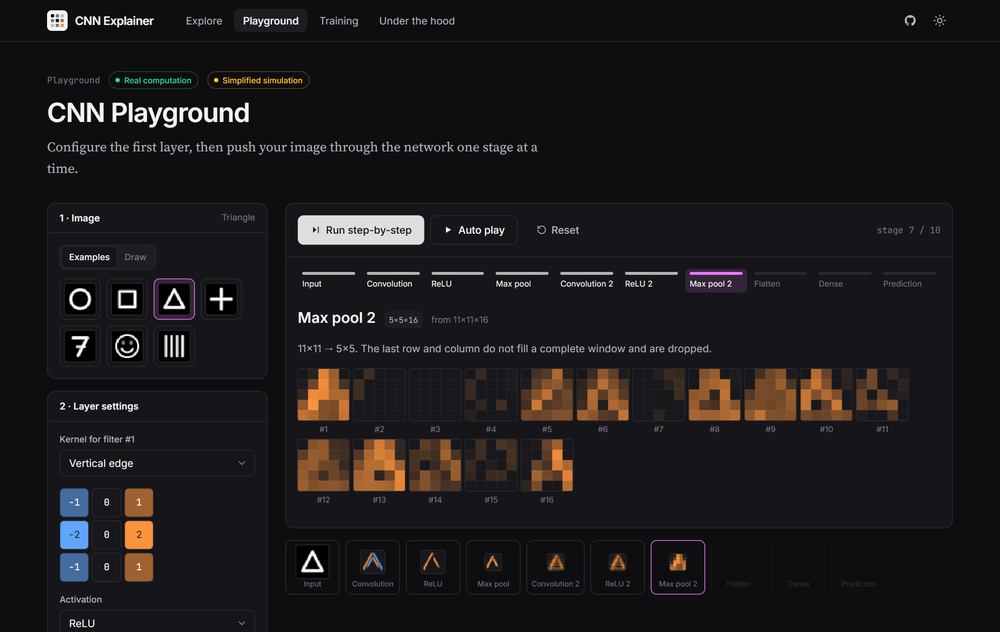
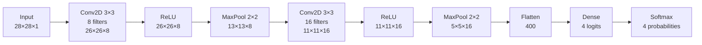
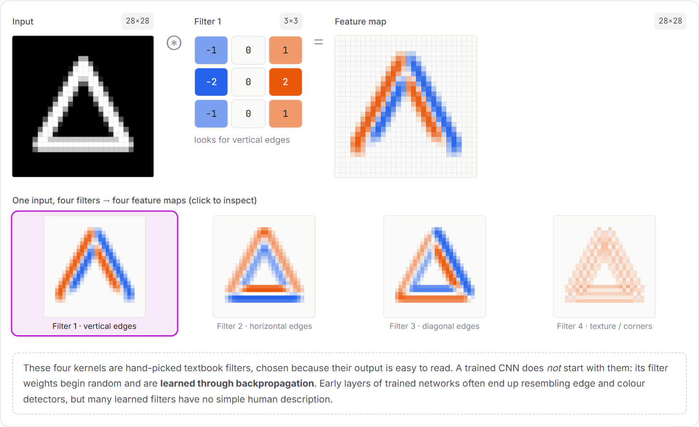
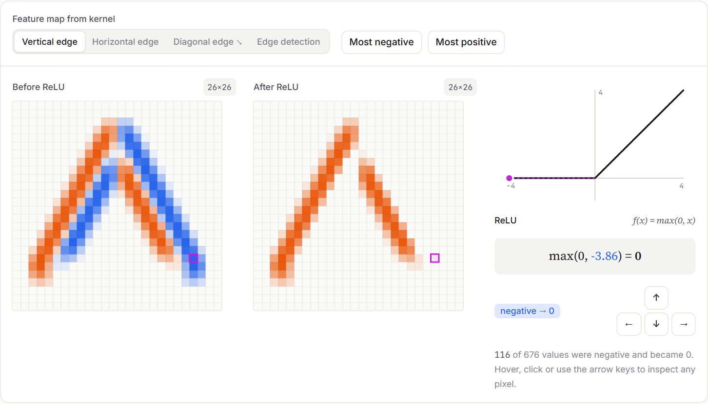
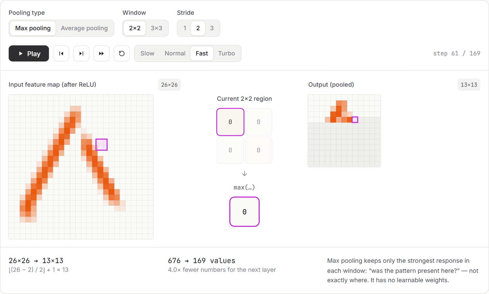
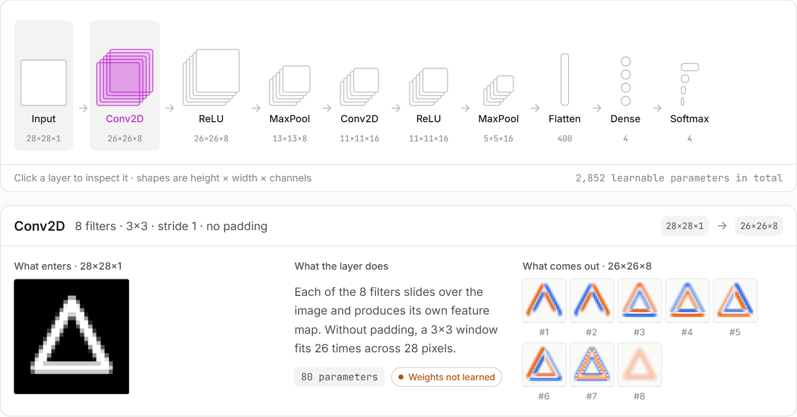
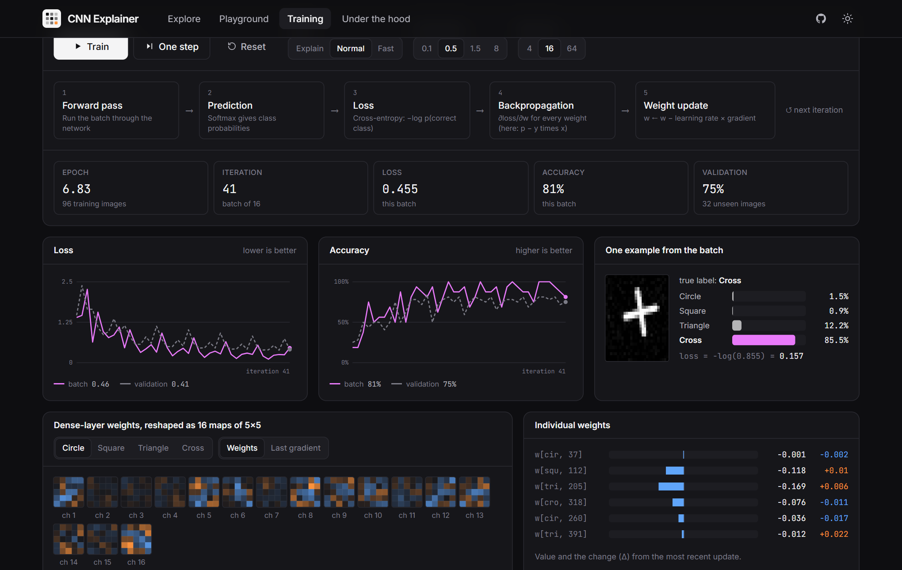

# CNN Explainer

A visual, interactive explanation of how convolutional neural networks work.

You pick an image and follow it through a small CNN: convolution, activation, pooling, flatten, a dense layer and softmax. The numbers on screen are computed live, so when you draw something new, swap a kernel or change the stride, every stage updates. It all runs in the browser.



## Demo

Live: [makifkaradag.github.io/cnn-explainer](https://makifkaradag.github.io/cnn-explainer/)

The interface is available in English and Turkish. Use the EN/TR switch in the top right corner.

| Convolution, step by step                                   | Playground in dark mode                                 |
| ----------------------------------------------------------- | ------------------------------------------------------- |
|  |  |

## Why this project?

Most introductions to CNNs give you either the equations or a diagram of boxes and arrows. I wanted something you can poke at. Each concept here is a small tool connected to a real implementation of the operation, so you can see why a feature map looks the way it does instead of taking it on faith.

The app also tries not to overclaim. Every visual has a label saying whether it shows real computation, real math on a deliberately tiny network, or an illustration drawn to build intuition.

## Features

The Explore page has ten chapters that build on each other. You start by choosing an input: one of seven built-in examples, a 28×28 drawing of your own, or an uploaded image that gets converted to grayscale in the browser. Hovering a pixel shows its value.

In the convolution chapter the kernel slides across the image while the panel shows each multiplication, the sum, the bias and the output pixel it produces. You can change kernel size, stride and padding, pick a preset or type your own weights. The following chapters cover feature maps from four different filters, ReLU with a plot that follows the value you inspect, and max/average pooling with an animated window.

After that comes the full network. Click any layer in the architecture diagram to see its input, its output, the shapes and the parameter count. The hierarchy chapter shows real layer 1 and 2 outputs next to labelled illustrations of what deeper layers tend to pick up. The dense layer is drawn with a subset of its connections, and hovering a neuron breaks its logit down over all 400 inputs. In the softmax chapter you can drag the logits and watch the probabilities follow.

The last chapter lets you change kernel, stride, padding, activation (ReLU, Leaky ReLU, sigmoid, tanh), pooling and the number of filters at once and see the result immediately.

There are three more pages. The Playground runs the whole network stage by stage or on auto-play. The Training page runs actual gradient descent and animates the forward pass, loss, backpropagation and weight update. Under the hood collects the formulas with worked examples and a short visual glossary.

Light and dark themes, mobile layouts and reduced-motion settings are supported.

## CNN pipeline



| Layer       | Output shape | Parameters | Notes                                 |
| ----------- | ------------ | ---------: | ------------------------------------- |
| Input       | 28×28×1      |          0 | grayscale, values in [0, 1]           |
| Conv2D 3×3  | 26×26×8      |         80 | hand-picked edge filters              |
| ReLU        | 26×26×8      |          0 |                                       |
| MaxPool 2×2 | 13×13×8      |          0 |                                       |
| Conv2D 3×3  | 11×11×16     |      1,168 | random with a fixed seed, not trained |
| ReLU        | 11×11×16     |          0 |                                       |
| MaxPool 2×2 | 5×5×16       |          0 | last row and column are dropped       |
| Flatten     | 400          |          0 |                                       |
| Dense       | 4            |      1,604 | trained in the browser                |
| Softmax     | 4            |          0 | circle, square, triangle, cross       |

## Interactive convolution

For every kernel position you see the window on the input, the weights, all k×k products, their sum and the resulting output pixel. Click the input to move the kernel there or click a cell of the output to jump to it. Playback has four speeds. Zero padding is drawn as hatched cells.

## Feature maps



Each kernel lights up a different pattern. These are textbook kernels chosen because their output is easy to read. A trained CNN learns its own filters through backpropagation, and many of them have no simple description, which the app says plainly.

## ReLU



## Pooling



## CNN architecture



## Training simulation



The loss, accuracy and weight changes on this page come from real mini-batch gradient descent on softmax cross-entropy. To keep it fast, only the final dense layer is trained. The convolutional filters stay frozen, the training set is 96 synthetic drawings and accuracy is checked on 32 drawings the model has not seen.

## Mathematical foundations

| Operation                       | Formula                                                                    |
| ------------------------------- | -------------------------------------------------------------------------- |
| Convolution (cross-correlation) | `y(i,j) = Σₘ Σₙ x(i·s + m − p, j·s + n − p) · K(m,n) + b`                  |
| Output size                     | `⌊(n + 2p − k) / s⌋ + 1`                                                   |
| ReLU                            | `f(x) = max(0, x)`                                                         |
| Max pooling                     | `MaxPool(X) = max over window of Xᵢⱼ`                                      |
| Softmax                         | `softmax(zᵢ) = exp(zᵢ) / Σⱼ exp(zⱼ)`, with max(z) subtracted first         |
| Cross-entropy                   | `L = −log p(correct class)`, and its gradient w.r.t. the logits is `p − y` |

These are implemented in [`src/lib`](src/lib) as plain TypeScript with no framework code, and the unit tests in [`math.test.ts`](src/lib/math.test.ts) and [`network.test.ts`](src/lib/network.test.ts) check them against hand-computed results.

## Tech stack

React 19 and TypeScript in strict mode, built with Vite. Styling is Tailwind CSS v4 and animation uses [Motion](https://motion.dev). The visualisations are drawn with canvas and SVG directly, without a chart library. Tests run on Vitest, and the code is checked with ESLint and formatted with Prettier.

## Installation

You need Node.js 20.19 or newer.

```bash
git clone https://github.com/Makifkaradag/cnn-explainer.git
cd cnn-explainer
npm install
```

## Usage

```bash
npm run dev          # dev server at http://localhost:5173
npm run build        # type-check and build to dist/
npm run preview      # serve the production build
npm test             # unit tests
npm run lint         # ESLint
npm run format       # Prettier
```

### Deployment

The build is static, uses relative asset paths and hash routing, so the `dist/` folder works on any static host.

This repository deploys to GitHub Pages through [`.github/workflows/deploy.yml`](.github/workflows/deploy.yml). Every push to `main` is linted, tested, built and published. If you fork it, enable Settings → Pages → Source: GitHub Actions and change `REPO_URL` in [`src/config.ts`](src/config.ts).

## Project structure

```
src/
├── components/
│   ├── layout/              # header with language switch, footer, chapter wrapper
│   ├── ui/                  # buttons, segmented controls, tags, icons, playback controls
│   ├── PixelGrid.tsx        # canvas renderer for any matrix, with hover and highlights
│   ├── ImageInput.tsx       # examples, drawing pad, upload, pixel inspector
│   ├── ConvolutionVisualizer.tsx
│   ├── KernelEditor.tsx
│   ├── FeatureMap.tsx, FeatureMapExplorer.tsx
│   ├── ReLUVisualizer.tsx, ActivationVisualizer.tsx
│   ├── PoolingVisualizer.tsx
│   ├── CNNArchitecture.tsx, FeatureHierarchy.tsx
│   ├── FlattenVisualizer.tsx, DenseVisualizer.tsx
│   ├── SoftmaxVisualizer.tsx, ExperimentPanel.tsx
│   ├── TrainingSimulator.tsx, LineChart.tsx
│   └── PipelineHero.tsx
├── pages/                   # Home, Explore, Playground, Training, Concepts
├── lib/                     # math and simulation, no React
│   ├── convolution.ts       # convolve2d, conv2d, single-step breakdown, output sizes
│   ├── pooling.ts           # max and average pooling
│   ├── activations.ts       # ReLU, Leaky ReLU, sigmoid, tanh
│   ├── softmax.ts           # stable softmax, cross-entropy
│   ├── network.ts           # the tiny CNN: weights, forward pass, layer specs
│   ├── training.ts          # synthetic dataset and gradient descent for the dense layer
│   ├── raster.ts            # draws the example shapes and training data
│   └── image.ts, colors.ts, tensor.ts, random.ts, views.ts
├── i18n/                    # typed English and Turkish dictionaries, language context
├── data/                    # example images, kernel presets, chapter order
├── context/                 # shared input image and theme
├── hooks/                   # useStepper for animations, useForward for the forward pass
└── types/
```

## Educational limitations

The network is tiny. It has 2,852 parameters, takes 28×28 grayscale images and knows four synthetic classes. Give it a smiley or a photo and it will still pick one of those four.

Its first-layer filters were chosen by hand and the second layer is random, so only the dense layer is learned. A real CNN learns every weight from data, is much deeper and wider, and usually adds things like batch normalisation, residual connections and data augmentation.

The feature hierarchy chapter mixes real outputs for layers 1 and 2 with drawings for layers 3 and 4. It shows a pattern often seen in trained networks, not something every network is guaranteed to learn.

## Future improvements

- Train the convolutional layers as well, with full backpropagation running in a Web Worker.
- Load a small pretrained MNIST model and compare its learned filters with the hand-picked ones.
- Support RGB input and show each channel.
- Add saliency maps or Grad-CAM to show which pixels drove a prediction.
- Encode the current drawing and settings in the URL so a state can be shared.

## License

[MIT](LICENSE)
