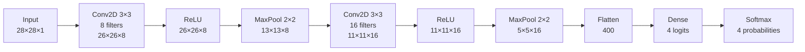

# CNN Explainer

A visual and interactive explanation of how Convolutional Neural Networks work.

Follow a single image through every stage of a small CNN — convolution, activation, pooling, flatten, dense and softmax — and watch the real numbers change as you draw, upload, pick kernels and tweak hyper-parameters. Everything runs in the browser: no backend, no Python, no GPU.


## Demo

**Live demo:** **[makifkaradag.github.io/cnn-explainer](https://makifkaradag.github.io/cnn-explainer/)**

| Convolution, step by step                                   | Playground (dark mode)                                  |
| ----------------------------------------------------------- | ------------------------------------------------------- |
|  |  |

## Why this project?

Most CNN explanations are either a wall of equations or a diagram with arrows. This project sits in between: every concept is a small interactive instrument wired to a **real implementation** of the operation, so you can see _why_ the output looks the way it does.

It is also careful about honesty. Each visual is labelled as one of:

- **Real computation** — produced by the math implemented in `src/lib`, live on your image.
- **Simplified simulation** — real math on a deliberately tiny network.
- **Illustrative** — a conceptual picture, not computed by a trained model.

## Features

- **Your own input** — pick one of 7 built-in examples, draw on a 28×28 canvas, or upload an image (converted to grayscale in the browser). Hover any pixel to read its value.
- **Animated convolution** — the kernel slides over the image while every multiplication, the sum, the bias and the resulting output pixel are shown. Change kernel size, stride, padding, preset or edit individual weights.
- **Feature maps** — one input through four filters, side by side.
- **ReLU** — before/after maps, a function plot that tracks the inspected value, keyboard navigation.
- **Pooling** — max vs. average, window size and stride, animated window and live output-size formula.
- **Clickable architecture** — every layer shows what enters, what it does, what comes out, shapes and parameter counts.
- **Feature hierarchy** — real layer-1/2 maps plus clearly labelled illustrations of deeper layers, with a growing receptive field.
- **Flatten & Dense** — animated flattening and a fully connected layer drawn with a representative subset of weights; hover a neuron to see how its logit adds up over all 400 inputs.
- **Softmax** — drag logits and watch exponentials and probabilities respond.
- **"What happens if…?"** — kernel, stride, padding, activation (ReLU / Leaky ReLU / Sigmoid / Tanh), pooling type and size, and number of filters, all updating instantly.
- **CNN Playground** — run the full network step-by-step or in auto-play.
- **Training** — genuine mini-batch gradient descent with an animated forward → loss → backprop → update loop, loss/accuracy curves and weights changing in real time.
- **Under the hood** — formulas with worked examples computed by the same code, plus a visual glossary.
- English and Turkish interface with a language switch (follows the browser language on first visit).
- Light/dark mode, responsive layout, reduced-motion support.

## CNN pipeline



| Layer       | Output shape | Parameters | Notes                              |
| ----------- | ------------ | ---------: | ---------------------------------- |
| Input       | 28×28×1      |          0 | grayscale, values in [0, 1]        |
| Conv2D 3×3  | 26×26×8      |         80 | hand-designed edge filters         |
| ReLU        | 26×26×8      |          0 |                                    |
| MaxPool 2×2 | 13×13×8      |          0 |                                    |
| Conv2D 3×3  | 11×11×16     |      1,168 | random (seeded), frozen            |
| ReLU        | 11×11×16     |          0 |                                    |
| MaxPool 2×2 | 5×5×16       |          0 | last row/column dropped            |
| Flatten     | 400          |          0 |                                    |
| Dense       | 4            |      1,604 | trained in the browser             |
| Softmax     | 4            |          0 | Circle · Square · Triangle · Cross |

## Interactive convolution

The kernel window, the corresponding weights, all `k×k` products, their sum, the bias and the output pixel are shown for every position. Click the input to move the kernel, click the output to jump to any position, or press play (four speeds). Zero padding is drawn as hatched cells.

## Feature maps


Different kernels respond to different patterns. The app is explicit that these are textbook kernels picked for readability — trained CNNs **learn** their filters through backpropagation and many learned filters have no simple description.

## ReLU


## Pooling


## CNN architecture


## Training simulation


The training page runs **real** mini-batch gradient descent on softmax cross-entropy — loss, accuracy and weight updates are not faked. To keep it instant, only the final Dense layer is trained (the convolutional filters are frozen) on 96 synthetic shape drawings, and evaluated on 32 unseen ones.

## Mathematical foundations

| Operation                       | Formula                                                                        |
| ------------------------------- | ------------------------------------------------------------------------------ |
| Convolution (cross-correlation) | `y(i,j) = Σₘ Σₙ x(i·s + m − p, j·s + n − p) · K(m,n) + b`                      |
| Output size                     | `⌊(n + 2p − k) / s⌋ + 1`                                                       |
| ReLU                            | `f(x) = max(0, x)`                                                             |
| Max pooling                     | `MaxPool(X) = max over window of Xᵢⱼ`                                          |
| Softmax                         | `softmax(zᵢ) = exp(zᵢ) / Σⱼ exp(zⱼ)` (computed with the max-subtraction trick) |
| Cross-entropy                   | `L = −log p(correct class)`; gradient w.r.t. logits is `p − y`                 |

All of these live in [`src/lib`](src/lib) as plain, framework-free TypeScript and are covered by unit tests ([`math.test.ts`](src/lib/math.test.ts), [`network.test.ts`](src/lib/network.test.ts)).

## Tech stack

- [React 19](https://react.dev) + [TypeScript](https://www.typescriptlang.org) (strict)
- [Vite](https://vite.dev)
- [Tailwind CSS v4](https://tailwindcss.com)
- [Motion](https://motion.dev) for animation
- Canvas + SVG for all visualisations (no chart library)
- [Vitest](https://vitest.dev), ESLint, Prettier

## Installation

Requires Node.js 20.19+ or 22+.

```bash
git clone https://github.com/Makifkaradag/cnn-explainer.git
cd cnn-explainer
npm install
```

## Usage

```bash
npm run dev          # start the dev server at http://localhost:5173
npm run build        # type-check and build to dist/
npm run preview      # serve the production build
npm test             # run the unit tests
npm run lint         # ESLint
npm run format       # Prettier
```

### Deployment

The build is fully static and uses relative asset paths plus hash routing, so `dist/` works on any static host.

For **GitHub Pages**, push to `main` and enable _Settings → Pages → Source: GitHub Actions_. The included workflow ([`.github/workflows/deploy.yml`](.github/workflows/deploy.yml)) lints, tests, builds and deploys. If you fork the project, update `REPO_URL` in [`src/config.ts`](src/config.ts).

## Project structure

```
src/
├── components/
│   ├── layout/              # Layout (header, language switch, footer), Chapter wrapper
│   ├── ui/                  # Buttons, segmented controls, tags, icons, playback controls
│   ├── PixelGrid.tsx        # Canvas renderer for any matrix (hover, click, highlights)
│   ├── ImageInput.tsx       # Examples, DrawPad, upload, pixel inspector
│   ├── ConvolutionVisualizer.tsx
│   ├── KernelEditor.tsx
│   ├── FeatureMap.tsx / FeatureMapExplorer.tsx
│   ├── ReLUVisualizer.tsx / ActivationVisualizer.tsx
│   ├── PoolingVisualizer.tsx
│   ├── CNNArchitecture.tsx / FeatureHierarchy.tsx
│   ├── FlattenVisualizer.tsx / DenseVisualizer.tsx
│   ├── SoftmaxVisualizer.tsx / ExperimentPanel.tsx
│   ├── TrainingSimulator.tsx / LineChart.tsx
│   └── PipelineHero.tsx
├── pages/                   # Home, Explore, Playground, Training, Concepts
├── lib/                     # Framework-free math and simulation
│   ├── convolution.ts       # convolve2d, conv2d, convolutionStep, output sizes
│   ├── pooling.ts           # max / average pooling
│   ├── activations.ts       # ReLU, Leaky ReLU, sigmoid, tanh
│   ├── softmax.ts           # stable softmax, cross-entropy
│   ├── network.ts           # the tiny CNN: weights, forward pass, layer specs
│   ├── training.ts          # synthetic dataset, gradient descent for the Dense layer
│   ├── raster.ts            # anti-aliased shape rasteriser for examples and data
│   └── image.ts, colors.ts, tensor.ts, random.ts, views.ts
├── data/                    # Example images, kernel presets, chapter list
├── context/                 # Shared input image and theme
├── i18n/                    # en.ts / tr.ts dictionaries (typed), language context
├── hooks/                   # useStepper (animation), useForward (memoised forward pass)
└── types/
```

## Educational limitations

- The network is tiny (2,852 parameters), works on 28×28 grayscale images and knows only 4 synthetic classes. Anything else — a smiley, a digit, a photo — is still forced into one of them.
- First-layer filters are hand-designed and second-layer filters are random. Only the Dense layer is trained. Real CNNs learn **all** weights from data with backpropagation.
- Production CNNs are far deeper and wider and use additional components (batch normalisation, residual connections, data augmentation, …).
- The feature-hierarchy chapter mixes real maps (layers 1–2) with illustrations (layers 3–4). It conveys an intuition seen in many trained networks, not a guarantee.

## Future improvements

- Train the convolutional layers too (full backpropagation through conv and pooling) in a Web Worker.
- Load a small pretrained MNIST model and compare its learned filters with the hand-designed ones.
- RGB input with per-channel visualisation.
- Saliency maps / Grad-CAM to show which pixels drove a prediction.
- Shareable URLs that encode the current drawing and settings.

## License

[MIT](LICENSE)
